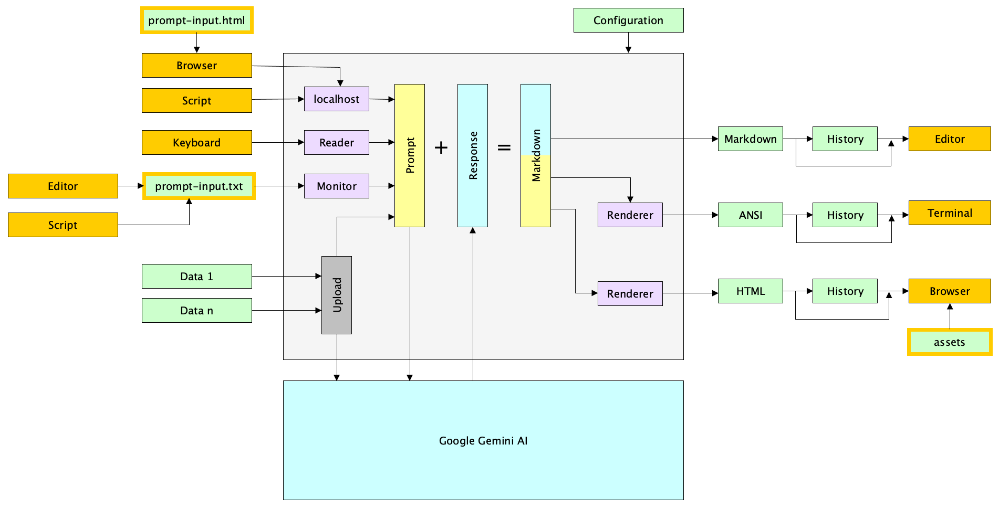

English version below ...

## gemini-prompt

### Vorbemerkungen

Künstliche Intelligenz (KI) verändert unsere Strategie der Informationsbeschaffung und -verarbeitung. Interessant ist auch die Möglichkeit eigene Dokumente an die KI hochzuladen. Anschließende Abfragen beziehen sich dann auf den Kontext der hochgeladenen Dokumente. Qualifizierte und strukturierte Antworten sind oft über einen längeren Zeitraum wertvoll. Sie erfordern ein Konzept zur Archivierung. Auch die Anreicherung mit weiteren Information und eigenen Bewertungen kann sinnvoll sein. Dies alles erfordert ein anderes Vorgehensmodell als wie bisher bei klassischen Internetrecherchen üblich. Die Nutzung von KI muss sich nahtlos in die eigene Arbeitumgebung und das eigene Arbeitsmodell integrieren. 

### Intention

Die Anwendung ermöglicht die nahtlose Integration von 'Google Gemini KI' in die eigene Arbeitsumgebung:

* CLI (Command Line Interface)
* GUI (Graphical User Interface)

### Nutzung

'Google Gemini KI' kann auf unterschiedliche Arten genutzt werden:

* Allgemeine Nutzung: Abfragen mit Bezug auf allgemeines Wissen
* Spezielle Nutzung: Abfragen mit Bezug auf eigene Dokumente

Als Ergebnis entstehen immer Abfrage+Antwort-Dateien:

* Markdown (native Antwort)
* ANSI (Terminal)
* HTML (Browser)

Jede Abfrage+Antwort-Datei kann in einer Historie archiviert werden.

Die Anwendung ist verfügbar für die Betriebssysteme BSD, Linux, macOS und Windows.

Eine Abfrage kann auf folgende Arten eingegeben / ausgelöst werden:

* direkte Eingabe via Kommandozeile
* sichern der internen Eingabedatei
* senden der Abfrage an 'localhost'

### Google Gemini KI

Google stellt im Rahmen der Gemini-KI-Familie unterschiedliche KI-Modelle für unterschiedliche Anwendungszwecke zur Verfügung. Im Rahmen der Konfiguration der Anwendung können viele Parameter des KI-Modells konfiguriert werden. Zum Beispiel:

* KI-Modell (Name)
* Anzahl der Antworten (Candidates)
* Varianz der Antworten (Temperature)

### Installation, Konfiguration

Die Anwendung beinhaltet intern alle für die Nutzung erforderlichen Komponenten. Beim Start der Anwendung werden fehlende Komponenten automatisch installiert. Das heißt, es ist ausreichend, die Anwendung in ein beliebiges Verzeichnis zu kopieren und zu starten. Dies erlaubt auf sehr einfache Art und Weise die projektbezogene Nutzung der Anwendung. Die Anwendung kann umfangreich über eine YAML-Datei konfiguriert werden.

### Eingabe der Abfragen

**Kommandozeile:** Im Terminal ist die direkte Eingabe einer einzeiligen Abfrage via Tastatur möglich. Beginnt die Eingabe mit '<<<' wird der nachfolgende Text als Dateiname interpretiert. Der Inhalt der Datei wird dann als Abfrage an die 'Google Gemini KI' geschickt.

**Textdatei:** Komfortabler ist die Eingabe einer ein-/mehrzeiligen Abfrage über einen Texteditor (oder ähnliches) und das Speichern der Abfrage in einer speziellen Eingabedatei der Anwendung. Diese Datei hat den Namen 'prompt-input.txt' (konfigurierbar) und wird durch die Anwendung auf Veränderungen überwacht. Wird die Datei mit einem neuen Zeitstempel gespeichert, so erkennt die Anwendung dies als Aufforderung, den Inhalt der Datei an die 'Google Gemini KI' zu schicken.

**localhost:** Die Anwendung stellt auf Port '4242' (konfigurierbar) einen lokalen Webserver bereit. Eingehende Daten werden als Abfrage an die 'Google Gemini KI' geschickt.

**Browser:** In der Praxis hat sich ein Browser sowohl für die Erstellung von Abfragen, als auch als Medium für die Präsentation der Ausgabe erwiesen. Die Webseite 'prompt-input.html' kann zur Erstellung von Abfragen benutzt werden. Über den Button 'Send to Localhost' wird die Abfrage dann ausgeführt.

### Ausgabe der Abfrage+Antwort-Paare

**Terminal:** Die Ausgabe erfolgt in strukturierter Form direkt im Terminal. Die Farbgestaltung der Ausgabe orientiert sich dabei an einem Terminal mit schwarzem Hintergrund. Die ANSI-Steuercodes lassen sich jedoch umdefinieren und so an das eigene Terminal anpassen. 

**Markdown-Editor/Viewer:** Die Ausgabe erfolgt über einen Markdown-Editor oder -Viewer. Anpassungen an das optische Erscheinungsbild der strukturierten Ausgabe sind oft durch Themes oder Styles möglich.

**Browser:** Die Ausgabe erfolgt über den (Standard-)Browser der Desktop-Umgebung und bietet viele Anpassungs- und Nutzungsmöglichkeiten:

* Automatische Anzeige des Abfrage+Antwort-Paars, nachdem es verfügbar ist
* Vollständige Kontrolle über die Darstellung der Webseite (CSS, Javascript)
* Organisation der Abfrage+Antwort-Paare in Browser-Fenstern oder -Tabs

### Benachrichtigungen

Im Gegensatz zur klassischen Internet-Recherche ('googeln') erhält man bei KI-Abfragen in der Regel keine sofortige Antwort. Abhängig von der Komplexität der Anfrage und des KI-Modells, benötigt die Generierung der qualifizierten Antwort etwas Zeit (z.B. 20-60 Sekunden). Es können
Benutzerhinweise konfiguriert werden, die über das Eintreffen einer Abfrage und/oder Antwort informieren.

### Fazit

Die Anwendung unterstützt zwei primäre Szenarien:

* Die Anwendung wird in einem Terminal benutzt.
  * Alle Ein- und Ausgaben erfolgen direkt im Terminal.
* Die Anwendung wird als Controller verwendet.
  * Eingaben erfolgen via Datei oder 'localhost'.
  * Ausgaben erfolgen in einem GUI-Programm.

### Nutzung, Einschränkungen

Diese Anwendung dient zur Evaluierung des Konzepts zur "Integration und Nutzung von KI in der eigenen, individuellen Arbeitsumgebung". Alle Versionen v0.x benötigen einen sogenannten Gemini-API-Key, der die kostenfreie und eingeschränkte Nutzung von 'Google Gemini KI' ermöglicht. Ein Gemini-API-Key wird einem persönlichen Google-Account zugeordnet und erlaubt die **testweise** Nutzung der 'Google Gemini KI'. Ein Gemini-API-Key ist nicht für die dauerhafte und/oder umfangreiche Nutzung der 'Google Gemini KI' gedacht. Ab der Version v1.0 wird die Nutzung der Anwendung auf einen regulären Google-Gemini-Account umgestellt. 

### Welche Nutzungsbedingungen gelten, wenn ich Gemini verwende?

Die Verwendung von Gemini unterliegt den [Google-Nutzungsbedingungen](https://policies.google.com/terms) und der [Richtlinie zur unzulässigen Nutzung von generativer KI](https://policies.google.com/terms/generative-ai/use-policy). Wenn du Unterhaltungen aus Gemini exportierst, gelten für die Kopie die Nutzungsbedingungen und Richtlinien des Dienstes, in den du exportierst. Weitere Informationen darüber, wie Google deine Gemini-Apps-Daten nutzt, findest du im [Gemini-Apps Privacy Hub](https://support.google.com/gemini?p=privacy_help).

Siehe auch [häufig gestellte Fragen zu Gemini-Apps](https://gemini.google.com/faq?hl=de).

### Hinweise zur frei verfügbaren Version von 'Google Gemini AI'

* Alle Ein- / Ausgabedaten werden von Google verwendet um das 'Gemini AI Model' zu verbessern.
* Nach Aussage von Google werden die Daten damit 'öffentlich'.
* Verarbeiten Sie also keine privaten oder vertraulichen Daten.
* Fazit: Der Anwender 'bezahlt' für die Nutzung von 'Google Gemini AI' mit seinen Daten.

### Hinweise zur kostenpflichtigen Version von 'Google Gemini AI'

* Google verwendet die eingegebenen Daten **nicht** um das 'Gemini AI Model' zu verbessern.
* Nach Aussage von Google bleiben die Daten damit 'privat'.
* Fazit: Der Anwender bezahlt für die Nutzung von 'Google Gemini AI' mit Geld.

### Token-Output-Limit

Jedes Gemini-KI-Modell definiert eine nicht änderbare, maximale Anzahl an Output-Tokens. Dieser Wert begrenzt die Länge der Antwort des KI-Modells.
Ein Token entspricht dabei grob circa 4 Zeichen, 100 Token in etwa 60 bis 80 englischen Wörtern. Definiert das KI-Modell das Output-Token-Limit
mit zu Beispiel 8192 Tokens, so entspricht das einer maximalen Antwortlänge von 4900 bis 6500 englischen Wörtern.

### Ratenlimits

Dieses Programm ist kein Multi-User-Service, sondern wird typischerweise von genau einem Anwender genutzt. Bei dieser Nutzungsart sind die Unterschiede in den
Ratenlimits (Anfragen pro Minute (RPM), Anfragen pro Tag (RPD), Tokens pro Minute (TPM)) zwischen der frei verfügbaren Version und der kostenpflichtigen Version 
von 'Google Gemini AI' irrelevant.

### Erforderliche Vorbedingungen

Um die Anwendung zu nutzen und zu evaluieren, ist ein persönlicher Google-Gemini-API-Key erforderlich:

* Beantragung eines persönlichen 'Gemini API-Keys' bei Google.
* Konfiguration des API-Keys im Programm-Environment:
  * macOS, Linux: 'export GEMINI_API_KEY=Your-API-Key'
  * Windows: 'setx GEMINI_API_KEY Your-API-Key' (erfordert Neustart des Terminals)

### Internet-Proxy

Um die 'Google Gemini KI' zu nutzen ist eine Verbindung mit dem Internet erforderlich:

* Direkte Verbindung: Client -> Internet
* Indirekte Verbindung: Client -> Proxy -> Internet

### Defekte / Diskussionen

Für einen Programmdefekt sollte eine entsprechende Fehlermeldung in der Rubrik 'Issues' eröffnet werden. Für alle anderen Themen, wie zum Beispiel   Fragen zur Nutzung, Fragen zum Konzept oder für neue Anforderungen, wäre die Rubrik 'Discussions' gut geeignet.

### Ausführbare Programme

Das Programm findet sich in ausführbarer Form (executable, binary) in 'Releases' (Sektion 'Assets').

***

***

## gemini-prompt

### Preliminary Remarks

Artificial intelligence (AI) is changing our strategy for information gathering and processing. Also interesting is the ability to upload your own documents to the AI. Subsequent prompts then refer to the context of the uploaded documents. Qualified and structured answers are often valuable over a longer period. They require a concept for archiving. Enrichment with further information and one's own evaluations can also be useful. All of this requires a different procedural model than previously common with classic internet research. The use of AI must seamlessly integrate into one's own working environment and working model.

### Intention

The application enables seamless integration of 'Google Gemini AI' into your own working environment:

* CLI (Command Line Interface)
* GUI (Graphical User Interface)

### Usage

'Google Gemini AI' can be used in different ways:

* General Usage: prompts related to general knowledge
* Specific Usage: prompts related to your own documents

The result is always prompt+response files:

* Markdown (native response)
* ANSI (Terminal)
* HTML (Browser)

Each prompt+response file can be archived in a history.

The application is available for the operating systems BSD, Linux, macOS, and Windows.

A prompt can be entered / triggered in the following ways:

* Direct input via command line
* Saving the internal input file
* Sending the prompt to 'localhost'

### Google Gemini AI

As part of the Gemini AI family, Google provides different AI models for different application purposes. Within the application's configuration, many parameters of the AI model can be configured. For example:

* AI Model (Name)
* Number of Answers (Candidates)
* Variance of Answers (Temperature)

### Installation, Configuration

The application internally includes all components required for use. Missing components are automatically installed when the application is started. This means it is sufficient to copy the application to any directory and start it. This allows for very easy project-related use of the application. The application can be extensively configured via a YAML file.

### Input of Prompts

**Command Line:** In the terminal, direct input of a single-line prompt is possible via the keyboard. If the input begins with '<<<', the following text is interpreted as a filename. The content of the file is then sent to 'Google Gemini AI' as a prompt.

**Text File:** More convenient is the input of a single/multi-line prompt via a text editor (or similar) and saving the prompt to a special input file of the application. This file is named 'prompt-input.txt' (configurable) and is monitored for changes by the application. If the file is saved with a new timestamp, the application recognizes this as a request to send the contents of the file to 'Google Gemini AI'.

**localhost:** The application provides a local web server on port '4242' (configurable). Incoming data is sent to 'Google Gemini AI' as a prompt.

**Browser:** In practice, a browser has proven useful both for creating prompts and as a medium for presenting the output. The webpage 'prompt-input.html' can be used to create prompts. The prompt is then executed via the 'Send to Localhost' button.

### Output of Prompt+Response Pairs

**Terminal:** The output is displayed in a structured form directly in the terminal. The color scheme of the output is based on a terminal with a black background. However, the ANSI control codes can be redefined and thus adapted to your own terminal.

**Markdown Editor/Viewer:** The output is via a Markdown editor or viewer. Adjustments to the visual appearance of the structured output are often possible through themes or styles.

**Browser:** The output is via the (default) browser of the desktop environment and offers many customization and usage options:

* Automatic display of the prompt+response pair after it is available
* Full control over the presentation of the webpage (CSS, Javascript)
* Organization of prompt+response pairs in browser windows or tabs

### Notifications

In contrast to classic internet research ('googling'), you usually do not receive an immediate response to AI prompts. Depending on the complexity of the request and the AI model, generating a qualified response takes some time (e.g. 20-60 seconds). User hints can be configured to inform you about the arrival of a prompt and/or response.

### Conclusion

The application supports two primary scenarios:

* The application is used in a terminal.
  * All inputs and outputs are directly in the terminal.
* The application is used as a controller.
  * Inputs are via file or 'localhost'.
  * Outputs are in a GUI program.

### Usage, Restrictions

This application serves to evaluate the concept of "integration and use of AI in your own, individual working environment." All versions v0.x require a so-called Gemini API key, which allows the free and limited use of 'Google Gemini AI'. A Gemini API key is assigned to a personal Google account and allows the **trial** use of 'Google Gemini AI'. A Gemini API key is not intended for permanent and/or extensive use of 'Google Gemini AI'. From version v1.0, the use of the application will be switched to a regular Google Gemini account.

### What terms of service apply to my Gemini usage?

The [Google Terms of Service](https://policies.google.com/terms) and the [Generative AI Prohibited Use Policy](https://policies.google.com/terms/generative-ai/use-policy) apply to this service. Keep in mind if you export conversations from Gemini, the terms & policies of the service you export to will apply to the copy. Go to the [Gemini Apps Privacy Hub](https://support.google.com/gemini?p=privacy_help) to learn more about how Google uses your Gemini Apps data.

See also [Gemini Apps FAQ](https://gemini.google.com/faq?hl=en).

### Notes concerning the freely available version of 'Google Gemini AI'

* All input and output data is used by Google to improve the 'Gemini AI Model'.
* According to Google, this means the data becomes 'public'.
* Therefore, do not process any private or confidential data.
* Conclusion: The user 'pays' for the use of 'Google Gemini AI' with their data.

### Notes on the Paid Version of 'Google Gemini AI'

* Google does not use the entered data to improve the 'Gemini AI Model'.
* According to Google, this means the data remains 'private'.
* Conclusion: The user pays for the use of 'Google Gemini AI' with money.

### Token Output Limit

Each Gemini AI model defines a non-modifiable, maximum number of output tokens. This value limits the length of the AI model's response. One token roughly corresponds to approximately 4 characters, 100 tokens to about 60 to 80 English words. If, for example, the AI model defines the output token limit as 8192 tokens, this corresponds to a maximum response length of 4900 to 6500 English words.

### Rate Limits

This program is not a multi-user service, but is typically used by exactly one user. For this type of usage, the differences in the rate limits (Requests Per Minute (RPM), Requests Per Day (RPD), Tokens Per Minute (TPM)) between the freely available version and the paid version of 'Google Gemini AI' are irrelevant.

### Required Prerequisites

To use and evaluate the application, a personal Google Gemini API key is required:

* Request a personal 'Gemini API Key' from Google.
* Configure the API key in the program environment:
  * macOS, Linux: 'export GEMINI_API_KEY=Your-API-Key'
  * Windows: 'setx GEMINI_API_KEY Your-API-Key' (requires terminal restart)

### Internet Proxy
To use the 'Google Gemini AI,' an internet connection is required:

* Direct connection: Client -> Internet
* Indirect connection: Client -> Proxy -> Internet

### Defects / Discussions

For a program defect, a corresponding error message should be opened in the 'Issues' section. For all other topics, such as questions about usage, questions about the concept, or for new requirements, the 'Discussions' section would be well suited.

### Executable Programs

The program can be found in executable form (executable, binary) in 'Releases' (section 'Assets').
